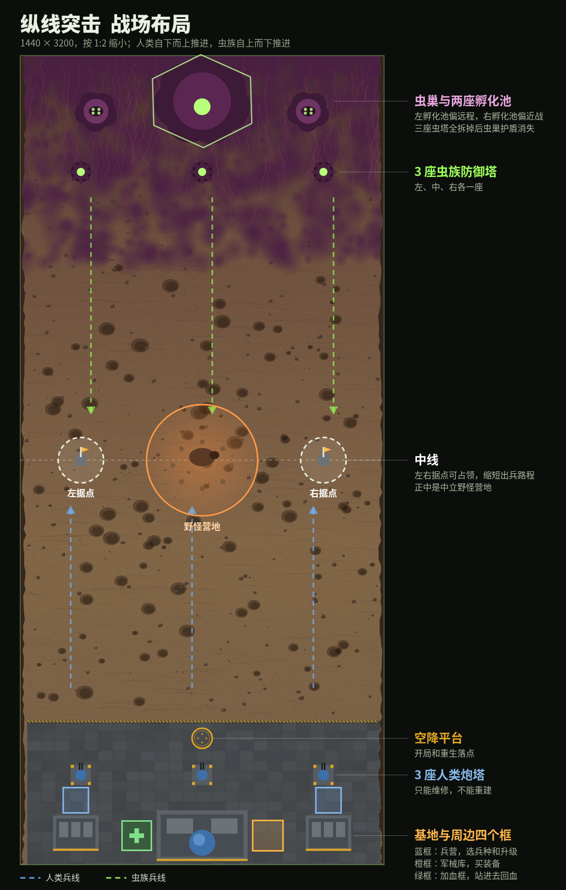

# 纵线突击 设计文档集

Oct 6, 2026 · @リュウ　ケン

## 1. 项目概述

《纵线突击》是一款单人、俯视角、纵向单线对推的射击游戏，一局 6 到 10 分钟。玩家乘运输机空降到人类基地，在双方自动出兵对冲的中路走位躲弹幕、扳转战局，拆掉虫族防御塔后摧毁虫巢。

| 项目 | 内容 |
| --- | --- |
| 类型 | 俯视角射击 + 单线对推（类 MOBA 兵线） |
| 视角 | 正上方垂直俯视，镜头锁定主角，地图纵向：上方虫族、下方人类 |
| 平台 | 网页优先（电脑 + 手机浏览器），后续视情况上 itch.io 或 Steam |
| 技术 | three.js 渲染，自写游戏逻辑 |
| 单局时长 | 6–10 分钟 |
| 目标玩家 | 玩过 2000 年代 Flash 小游戏的怀旧玩家；喜欢弹幕走位和塔防的轻度玩家 |

**核心体验（三句话）**

1. 一个人扳转兵线：双方自动对推势均力敌，玩家的位置和火力决定战线往哪边压。
2. 在弹幕里走位：绿色酸液弹幕可见、可躲，躲得好就能押着进攻。
3. 前压还是回防：重甲虫会绕过兵线拆塔，玩家要在推进和维修之间做取舍。

**参考与原创边界**：玩法参考 2008 年 Flash 游戏《Super Marine》（作者 aaldrin）。本项目只借鉴玩法结构，代码、美术、音效、名称全部原创，不使用原作任何素材。

## 2. 核心玩法与操作

战场宽 1440、长 3200 单位，双方基地各占一端，中间是争夺区。屏幕一次只显示约 480 宽的一块，镜头横竖都跟着主角。玩家是唯一可控单位，其余单位全部自动行动。

**战场结构（从上到下）**

| 位置（纵坐标） | 内容 |
| --- | --- |
| 0–340 | 虫巢（中心 y 180，约 380×300 的山丘状巨型有机体），左右各一座孵化池，虫族从孵化池出发，菌毯覆盖 |
| 460 | 三座虫族防御塔（直径约 100；左、中、右各一，横向间隔 480） |
| 520–2600 | 中路争夺区：陨石坑、碎石，双方兵线在此交火；纵坐标 1600 是中线，左右各一个据点，正中是中立野怪营地 |
| 2700 | 空降平台（开局和重生落点） |
| 2845 | 三座人类炮塔（80×80；左、中、右各一） |
| 3085 | 人类基地（360×200，带指挥高塔）居中，左右各一座兵营，小兵从兵营出发；基地右侧是军械库（正方形商店区），左侧是加血框 |

**对推规则**

- 左右两座兵营每 8 秒各派出一批小兵（兵种由玩家在兵营里选），每个小兵随机分到左、中、右三条路之一（对准三座炮塔，各有约 ±85 的横向浮动），向上推进，遇敌停下射击。
- 左右两座孵化池按关卡配置的间隔派出虫潮，数量和血量随时间增长。
- 所有自动单位攻击警戒范围内最近的敌人；攻城单位（重甲虫）只找建筑。

**单位 AI（行进与寻路）**

每个自动单位每帧按下面的优先级决定做什么：

| 优先级 | 条件 | 行为 |
| --- | --- | --- |
| 1 | 警戒范围内有敌人 | 近战贴上去咬；远程走到射程 90% 处停下射击，始终面朝目标 |
| 2 | 己方建筑正被敌人攻击（敌人在建筑 260 范围内），且自己离那个敌人不到 650 | 回防，直奔那个敌人 |
| 3 | 都没有 | 朝下一个可攻击的敌方建筑推进：离目标纵向超过 420 时先并入自己的路线再直走，进入 420 以内后直接走向目标 |

- **目标选择**：在所有可攻击的敌方建筑里，选「距离 + 0.8 × 与自己路线的横向偏差」最小的那个。所以本路防御塔还在就打本路的；本路塔倒了，就去打虫巢或基地，或支援旁边一路。有护盾的虫巢不算可攻击目标，小兵会先去拆防御塔。
- **转向**：行进中每秒最多转 4 弧度，转弯是弧线，不会原地瞬间掉头。
- **避障**：前方 110 范围内有建筑挡路（自己正在攻击的除外），就往偏离它的一侧绕开。
- **防卡住**：实际移动距离连续约 1 秒不到应有速度的 30%，就向左或右横跨 0.7 秒再继续。
- **朝向**：有目标时面朝目标，行进时面朝移动方向，不会出现走到地图尽头对着墙站着的情况。

验证：用无玩家的模拟对局（每局 300 秒、多个随机种子）比较改前改后。改前，一路炮塔被拆后，那一路的单位会径直走到对方地图边缘贴墙站着；双方炮塔全毁时，最多 6% 的单位时间耗在墙边，陆战队 4 分钟内一次也没打到虫巢。改后，贴墙时间是 0，卡住时间低于 0.3%，双方仍按三条路推进。不靠玩家时攻守强弱和改前大致相当。位置分布对比图见 `docs/ai_compare.png`。
- 任一虫族防御塔存活时，虫巢有护盾，免疫伤害。中立野怪（见第 9 部分）是第三方阵营，双方都会攻击它，它也攻击双方。

**主角能力**

| 能力 | 效果 | 获取方式 |
| --- | --- | --- |
| 射击 | 使用当前装备的武器，初始为突击步枪（每发 12 伤害，间隔 0.14 秒） | 军械库购买更换 |
| 翻滚 | 短冲刺，0.3 秒内子弹穿身，冷却 2.4 秒 | 自带 |
| 手雷 | 半径 70 范围 85 伤害，清除范围内酸液弹；消耗品，最多带 3 枚 | 军械库购买 |
| 维修 | 靠近受损的己方建筑按住，每秒修 100，每点耗 0.25 资源 | 自带 |
| 购物 | 走进军械库打开商店，买武器、护甲、手雷和各类强化 | 军械库 |

**军械库**：基地右侧一块 120×120 的正方形金属地台（中心约 x 980），四边亮灯。主角走进去，底部升起商店面板；走出来自动关闭。购物时游戏不暂停，敌人照常推进，所以回城购物本身有代价：离开战线越久，兵线越吃亏。这和「前压还是回防」一起，构成玩家最主要的两个取舍。

**加血框**：基地左侧一块 120×120 的正方形地台（中心约 x 460），绿色边框，和右侧的军械库对称。主角站进去每秒回复 40 生命，免费，走出来就停止。原来「靠近基地自动回血」的设定取消，回血只能来这里；4 秒没受伤时每秒回 3 的缓慢回血保留。和军械库一样，回来加血就意味着暂时离开战线。

**兵营与孵化池**

双方都不从老家直接出兵：人类基地左右各有一座兵营，虫巢左右各有一座孵化池。兵营前面各有一个 100×100 的交互框，主角走进去，底部升起兵营面板，可以选这座兵营生产什么兵、给兵营升级、给全军加训练。两座兵营可以生产不同的兵，比如左边出火焰兵守线，右边出火箭兵拆塔。

| 建筑 | 中心坐标 (x, y) | 尺寸 | 交互框 |
| --- | --- | --- | --- |
| 左兵营 | (220, 3075) | 180×140 | 正前方 (220, 2945)，与兵营中线对齐 |
| 右兵营 | (1220, 3075) | 180×140 | 正前方 (1220, 2945)，与兵营中线对齐 |
| 左孵化池 | (300, 220) | 直径约 180 | 无（虫族建筑） |
| 右孵化池 | (1140, 220) | 直径约 180 | 无（虫族建筑） |

兵营规则：

- 每座兵营每 8 秒出一批兵，兵种和人数由这座兵营当前的设置决定；切换兵种免费，从下一批开始生效。
- 兵营可以被虫族打坏，也可以像炮塔一样维修。被摧毁后这一侧停止出兵，主角走进它的交互框可以花 400 资源重建，重建后保留原来的等级。
- 兵营升级和部队训练替代了原来军械库里的「援军训练」。

孵化池规则：

- 左孵化池偏远程，每波 60% 是喷吐虫；右孵化池偏近战，出甲虫，等级达标后混入重甲虫。玩家可以决定先拆哪一边，改变虫潮的构成。
- 孵化池可以被摧毁（不需要先破盾），被毁的一侧停止出兵；两座都被毁后由虫巢自己出兵，速度减半。
- 每座孵化池每波出 ⌈每波数量 ÷ 2⌉ 个名额。新虫种占用普通虫子的名额：迫击虫、刺镰虫各占 2 个，飞虫、自爆虫各占 1 个，所以每波总量不变，只是成分更杂。（最初是额外加在波次上，模拟对局里第 3 关基地提前约 60 秒失守，改为占名额后与改前接近。）
- 胜利条件不变：仍然是摧毁虫巢。虫后照常从虫巢出来。

**中线据点与野怪营地**

中线（纵坐标 1600）横向分三段：左据点、中立野怪营地、右据点。中路兵线会撞上野怪，左右两路更顺，于是兵力自然分流；占住据点就能缩短出兵路程，这让 1440 宽的地图有了「在哪条线投入」的决策。



人类从下往上推，虫族从上往下推；两侧据点一开始是中立的（虚线圈），谁先占住谁的出兵路线就短一半。

| 位置 | 坐标 (x, y) | 内容 |
| --- | --- | --- |
| 左据点 | (240, 1600) | 可占领前哨，占领圈半径 90 |
| 野怪营地 | (720, 1600) | 中立野怪活动区，半径 220 |
| 右据点 | (1200, 1600) | 可占领前哨，占领圈半径 90 |

**据点规则**

- 占领：圈内只有一方单位时，占领进度向这一方推进；双方都在时进度停住，显示「争夺中」。人类 8 秒占满，主角在圈内时速度翻倍；虫族 10 秒占满。
- 据点不会被摧毁，只会易主。易主时据点上的小炮台按新主人重建。
- 开局两个据点都是中立。

| 占领方 | 收益 |
| --- | --- |
| 人类 | 每 10 秒从据点出 2 名机枪兵；据点小炮台自动开火（生命 400，单发 8，间隔 0.5 秒）；每秒额外 +1 资源 |
| 虫族 | 每 10 秒从据点刷 2 只甲虫；菌毯从据点向四周蔓延（纯视觉）；据点变成虫族刺塔（生命 400，每 2.5 秒放 8 发环形酸液弹） |

**野怪营地规则**

- 开局 2 分钟首次刷出：1 只沙原巨兽 + 1 群掘地虫（8 只）。营地清空后 120 秒重刷。
- 野怪不出营地范围，被拉出超过 260 就掉头回去并回血（见第 9 部分）。
- 谁打出沙原巨兽的最后一击，谁获得「巨兽之血」增益 45 秒：全体单位伤害 +20%、移动速度 +10%。人类拿到还有 200 赏金；虫族拿到只有增益。
- 金手指也能随时在营地或准星处刷野怪（第 9 部分）。

**胜负与重生**

- 胜利：虫巢生命归零。
- 失败：人类基地生命归零。
- 主角阵亡不算失败：5 秒后运输机重新空降，落地后 1.5 秒无敌。阵亡期间兵线继续对推，这就是死亡的代价。

**操作方案**

| 动作 | 键鼠 | 触屏 |
| --- | --- | --- |
| 移动 | WASD / 方向键 | 左半屏虚拟摇杆 |
| 瞄准射击 | 鼠标瞄准，按住左键；F 切换自动 | 自动瞄准最近敌人并射击 |
| 翻滚 | 空格 | 右下角翻滚按钮 |
| 手雷 | Q / 鼠标右键 | 右下角手雷按钮（投向最近敌人） |
| 维修 | 按住 E | 按住维修按钮 |
| 购物 | 走进军械库或兵营交互框，鼠标点选或按数字键 | 走进军械库或兵营交互框，点面板上的按钮 |
| 暂停 | P / Esc | 切出页面自动暂停 |

## 3. 单位与数值设计

以下数值全部来自 Demo 的配置表，是普通难度下的基准值。距离单位是游戏内坐标（战场宽 480），时间单位是秒。

**可移动单位**

| 单位 | 阵营 | 生命 | 速度 | 射程 | 伤害 | 攻击间隔 (秒) | 赏金 | 特点 |
| --- | --- | --- | --- | --- | --- | --- | --- | --- |
| 主角（陆战队员） | 人类 | 150 | 168 | 鼠标瞄准 | 12 | 0.14 | — | 唯一可控单位，判定圈缩小到 65% |
| 机枪兵 | 人类 | 50 | 48 | 165 | 7 | 0.6 | — | 自动推进，受兵营部队训练影响 |
| 甲虫 | 虫族 | 55 | 70 | 近战 | 9 | 0.7 | 8 | 快速冲锋，主要单位 |
| 喷吐虫 | 虫族 | 45 | 40 | 205 | 6 × 每发 | 2.5 | 12 | 前摇 0.6 秒身体鼓胀；连吐 3 波、每波 7 颗酸液滴，最后补 1 颗大酸球 |
| 重甲虫 | 虫族 | 260 | 34 | 近战 | 30 | 1.2 | 30 | 攻城：无视单位，直扑建筑 |
| 虫后（Boss） | 虫族 | 1600 | 26 | 230 | 7 × 每发 | 2.3 | 300 | 轮换螺旋弹幕、大扇形弹、召唤 3 只甲虫 |

**建筑**

| 建筑 | 阵营 | 生命 | 射程 | 攻击 | 间隔 (秒) | 备注 |
| --- | --- | --- | --- | --- | --- | --- |
| 人类基地 | 人类 | 3000 | — | 无 | — | 被摧毁即失败；左侧加血框内主角每秒回 40 血。占地 300×164，四周能同时挤下的虫子是小圆形碰撞时的三倍左右，所以血量从 1800 提到 3000（模拟对局里守住的比例与改前持平） |
| 炮塔 | 人类 | 700 | 235 | 单发 10 | 0.38 | 只能维修，不能重建 |
| 虫族防御塔 | 虫族 | 900 | 250 | 16 颗酸液滴环形弹 / 3 颗大酸球扇形弹交替 | 2.1 | 拆掉赏 150 |
| 虫巢 | 虫族 | 2600 | 240 | 20 颗酸液滴环形弹，每第三轮加 4 颗大酸球 | 2.4 | 护盾消失后才可受伤、才开始反击 |

**兵营可选兵种**（每批人数 = 基础人数 + 兵营等级 − 1，步行机甲除外）

| 兵种 | 解锁 | 每批基础人数 | 生命 | 速度 | 射程 | 伤害 | 攻击间隔 (秒) | 特点 |
| --- | --- | --- | --- | --- | --- | --- | --- | --- |
| 机枪兵 | 初始 | 3 | 50 | 48 | 165 | 7 | 0.6 | 均衡，可靠（初稿是 2 人；两座兵营合计每 8 秒 4 人少于原来基地的 5 人，模拟对局里兵线明显吃亏，改为 3 人） |
| 火焰兵 | 兵营 2 级 | 1 | 90 | 44 | 90 | 扇形持续，每秒 30 | 持续 | 克制甲虫群；射程短，怕喷吐虫 |
| 火箭兵 | 兵营 2 级 | 1 | 45 | 42 | 260 | 60，半径 40 范围 | 2.2 | 对重甲虫和建筑 ×1.5 |
| 医疗兵 | 兵营 3 级 | 1 | 60 | 48 | 120 | 不攻击，每秒治疗附近友军 12 | — | 让兵线更持久 |
| 步行机甲 | 兵营 3 级 | 每 3 批出 1 台 | 600 | 30 | 200 | 18 × 2 | 0.4 | 肉盾，吸引火力 |

**兵营面板**（主角站进兵营交互框时打开）

| 项目 | 价格 | 效果 |
| --- | --- | --- |
| 选择兵种 | 免费 | 从下一批开始生效 |
| 兵营 2 级 | 300 | 每批 +1 人；出兵间隔 8 → 7 秒；解锁火焰兵、火箭兵；兵营生命 1500 → 2000 |
| 兵营 3 级 | 600 | 每批再 +1 人；间隔 7 → 6 秒；解锁医疗兵、步行机甲；兵营生命 2500 |
| 部队训练 | 120 + 100 × 当前等级，上限 5 级 | 全军小兵生命和伤害 +20%，两座兵营共享 |
| 重建兵营 | 400 | 仅在这座兵营被摧毁后出现，重建后保留等级 |

**孵化池**：生命 1200，摧毁赏金 250；两座都被摧毁后，虫巢以一半速度自己出兵。

**扩展虫族兵种**（模型已在仓库 `assets/models/bugs/`，数值为初稿，待试玩调整）

每种新虫子出手前都有明显预警，让躲避变成「读招」：

| 兵种 | 生命 | 速度 | 攻击 | 赏金 | 预警与特点 | 出处 |
| --- | --- | --- | --- | --- | --- | --- |
| 自爆虫 | 30 | 85 | 贴身自爆，半径 60 内 45 伤害，对建筑 ×1.5 | 10 | 冲锋前背囊发亮、膨胀 0.6 秒；被打死会原地爆炸，波及周围虫子 | 右孵化池，第 2 关起 |
| 飞虫 | 35 | 110 | 俯冲刺击 8 | 10 | 飞行单位，越过兵线直扑后排和建筑；只有主角、火箭兵、炮塔能打到 | 两座孵化池，第 2 关起 |
| 迫击虫 | 90 | 30 | 抛射大酸球，射程 420，落点留酸液池 | 20 | 发射前地上出现落点圈 1 秒；射程比炮塔远，必须冲过去拆 | 左孵化池，第 3 关起 |
| 刺镰虫 | 120 | 75 | 镰刀横扫，前方扇形 22 伤害 | 18 | 抬起双镰 0.4 秒后横扫；甲壳厚，正面受伤 −30% | 右孵化池，第 3 关起 |

中立野怪「掘地虫群」和「沙原巨兽」、Boss「虫后」也已有对应模型（`assets/models/neutral/`、`assets/models/bugs/queen.glb`）。

**酸液弹规格**

原则是「看着大、判定小」：酸液弹要大、要密、要黏糊糊地往前涌，让人本能地想躲；但真正判定伤害的只是中间的亮芯，玩家擦着外圈穿过去不会受伤。这样画面有压迫感，又不会变成躲不开的不公平。

| 类型 | 视觉半径 | 判定半径 | 速度 | 伤害 | 特殊效果 |
| --- | --- | --- | --- | --- | --- |
| 酸液滴 | 10 | 5 | 160 | 5 | 拖出一段滴落的尾迹；落空后在地上留小块蚀痕 |
| 大酸球 | 22 | 12 | 100 | 14 | 飞行 1.6 秒或碰到目标时爆开，向四周溅出 8 颗酸液滴，并留下一滩酸液池 |
| 酸液池 | 半径 45 | 半径 40 | 不动 | 每秒 10 | 持续 3.5 秒；站在里面移动速度 −30%；冒泡并逐渐缩小 |

**恐怖感的表现**：喷吐虫前摇时身体鼓胀、发出咕噜声；酸液弹外圈半透明、边缘不规则地抖动，中间是刺眼的亮芯；被击中时屏幕边缘闪一下绿色，主角身上冒白烟 1 秒。同屏酸液弹上限从 1200 提到 2000。

**军械库商品**（主角走进基地右侧军械库购买；以下价格为普通难度）

武器：同一时间装备一把；买过的武器之后在军械库里可以免费切换。

| 武器 | 价格 | 每发伤害 | 射击间隔 (秒) | 射程 | 特点 |
| --- | --- | --- | --- | --- | --- |
| 突击步枪 | 初始 | 12 | 0.14 | 330 | 精准，各方面均衡 |
| 双管机枪 | 250 | 9 × 2 发 | 0.10 | 300 | 弹雨压制，散布大 |
| 霰弹枪 | 300 | 8 × 7 颗 | 0.6 | 180 | 近距离爆发，清甲虫群 |
| 等离子步枪 | 600 | 40 | 0.35 | 360 | 子弹穿透 3 个目标 |
| 火箭筒 | 900 | 120，半径 60 范围伤害 | 1.2 | 320 | 对建筑 ×1.5，拆塔利器 |

护甲：买更高一级直接替换，不能回退。

| 护甲 | 价格 | 最大生命 | 减伤 | 代价 |
| --- | --- | --- | --- | --- |
| 作战服 | 初始 | 150 | 0% | — |
| 复合护甲 | 150 | 200 | 10% | — |
| 动力装甲 | 400 | 260 | 20% | — |
| 重型动力装甲 | 800 | 340 | 30% | 移动速度 −10% |

其他：

| 商品 | 价格 | 效果 | 上限 |
| --- | --- | --- | --- |
| 手雷 | 每枚 40 | 补充 1 枚 | 携带 3 枚 |
| 医疗包 | 50 | 立即回满生命 | — |
| 武器强化 | 80 + 60 × 当前等级 | 所有武器伤害 +15% | 5 级 |
| 炮塔加固 | 150 + 120 × 当前等级 | 己方炮塔生命和伤害 +25% | 3 级 |

**经济**

- 开局 120 资源，每秒自动 +2。
- 击杀任何虫族单位都拿赏金，不论是谁打死的，鼓励玩家保护兵线而不是抢人头。
- 主要支出：军械库购物和维修。修满一座炮塔约 175 资源，和一件中级装备价格相当，形成取舍。

**虫潮成长公式**

- 波次等级 = 已用时间 ÷ 成长间隔（取整）。
- 每波数量 = min(15, 5 + 波次等级)，其中 40% 是喷吐虫。
- 虫族生命 × (1 + 0.06 × 波次等级)。
- 重甲虫：关卡允许且波次等级达标后，每波按 45% + 10% × 等级 的概率混入 1 只。
- 全图虫族超过 100 只时暂停出兵，防止卡顿。

**难度倍率**

| 项目 | 普通 | 困难 |
| --- | --- | --- |
| 兵营出兵间隔（1 级） | 8 秒 | 9.5 秒 |
| 虫族生命倍率 | ×1.0 | ×1.3 |
| 虫潮间隔 | 关卡值 | 关卡值 − 1 秒 |
| 成长间隔 | 关卡值 | 关卡值 ×0.7 |
| 虫后出场 | 关卡值 | 关卡值 − 30 秒 |

## 4. 关卡设计

Demo 做 3 关，地图布局相同，靠敌人组合、节奏和地表配色区分：第 1 关教操作，第 2 关教回防，第 3 关是 Boss 战。通关上一关解锁下一关。

| 关卡 | 主题 | 虫潮间隔 (秒) | 成长间隔 (秒) | 虫族生命 | 重甲虫 | 虫后 | 特殊设定 | 三星标准用时 |
| --- | --- | --- | --- | --- | --- | --- | --- | --- |
| 1 第一道防线 | 教学：移动、射击、躲弹、维修、升级 | 8 | 60 | ×0.85 | 无 | 无 | 分步教学提示 | 4:00 |
| 2 酸雨峡谷 | 压力：重甲虫迫使回防 | 7.5 | 50 | ×1.0 | 波次等级 ≥ 1 | 无 | 虫族防御塔生命 1100 | 5:00 |
| 3 虫后巢穴 | Boss 战 | 7 | 45 | ×1.0 | 波次等级 ≥ 2 | 150 秒出场 | 虫巢生命 3000 | 6:30 |

**星级评价**（每关最多 3 星，取历史最高）

1. 一星：通关。
2. 二星：通关时人类基地生命 ≥ 50%。
3. 三星：通关用时不超过该关标准用时。

**第 1 关教学提示（按触发顺序，每条只出现一次）**

| 触发条件 | 提示内容 |
| --- | --- |
| 空降完成 | 移动和射击的操作方法（键鼠和触屏各一版） |
| 第一只喷吐虫进入画面 | 绿色酸液弹可以躲，翻滚时子弹会穿过你 |
| 资源首次达到 150 | 回基地右侧军械库购物，地上有光圈和箭头指引 |
| 己方炮塔首次受损 | 靠近炮塔按住维修 |
| 主角首次靠近虫族防御塔 | 三座塔全拆掉才能打虫巢 |
| 主角首次被弹幕包围（周围 6 颗以上酸液弹） | 手雷可以清掉酸液弹 |

**节奏目标**：开局 0–1 分钟双方兵线在地图中部相遇；玩家不介入时战线缓慢向人类一方移动；玩家全力推进时，第 1 关约 3 分钟能拆第一座虫族防御塔。这些目标需要在试玩中验证后调整配置表。

## 5. UI/UX 设计

所有菜单界面用 HTML 叠在游戏画面上，战斗 HUD 用一层透明 2D 画布绘制。界面统一为战术终端风格：深色半透明面板、切角边框、窄体数字，琥珀色表示可操作和资源，酸绿色表示状态和目标。竖屏优先，电脑上居中显示为竖向画面。

（图：界面流程 · 8 个界面，见在线文档）

战斗中只有三条出路：暂停后继续或退回选关、阵亡后自动重新空降、胜负已分时进入结算。

**界面清单**

| 界面 | 主要元素 | 需要设计的状态 |
| --- | --- | --- |
| 主菜单 | 标题、开始游戏、设置、操作说明 | 背景是缓慢平移的战场 |
| 选关 | 3 张关卡卡片（名称、主题一句话、星级、最佳用时）、难度切换 | 未解锁、未通关、已通关 |
| 设置 | 画质（阴影开关）、屏幕震动开关、音效开关、允许金手指开关、清除存档 | 开 / 关 |
| 空降开场 | 关卡名、难度 | 运输机下降 2.3 秒 |
| 战斗 HUD | 见下表 | — |
| 暂停 | 继续、重新开始、返回选关；允许金手指时多一个「金手指」按钮 | — |
| 结算 | 胜负标题、用时、击杀、基地剩余生命、本局星级 | 胜利 / 失败；是否打破记录 |

**战斗 HUD 布局**

| 区域 | 内容 | 反馈规则 |
| --- | --- | --- |
| 左上第一块面板 | 主角分段生命条、资源、生命数值 | 生命低于 30% 变红；阵亡时显示重新空降倒计时 |
| 左上第二块面板 | 虫巢生命条、人类基地生命条 | 护盾中虫巢条变灰并显示剩余塔数；基地低于 30% 变红 |
| 右上角 | 用时、击杀数 | — |
| 右上角下方 | 全图小地图：建筑、单位、主角、当前视野框、据点归属、野怪营地 | 虫后用粉色大点标出 |
| Boss 条 | 虫后生命 | 仅虫后存活时显示 |
| 中上方 | 战况播报和教学提示 | 最多 3 条，最新一条带绿色标记 |
| 右下角 | 手雷、翻滚圆形按钮 | 冷却中按钮被扇形遮罩扫过并显示倒计时；手雷按钮显示剩余枚数，为 0 时置灰 |
| 底栏 | 维修按钮；主角站进军械库时，底部升起商店面板（武器、护甲、其他三栏）；站进兵营交互框时升起兵营面板（兵种、兵营升级、部队训练） | 钱不够或满级时置灰；已拥有的武器显示「装备」 |
| 世界内 | 受损单位头顶血条、维修提示、手雷落点圈、军械库、加血框和两座兵营交互框的地面光圈、据点占领进度环（人类蓝、虫族绿、争夺中闪烁）；主角离军械库较远时屏幕边缘有小箭头指向它 | 满血不显示血条 |

**反馈原则**

- 受击：单位闪白 0.07 秒；主角受伤时屏幕轻微震动（可在设置关闭，系统开了减少动画时默认关闭）。
- 重要事件（拆塔、护盾消失、虫后出场、基地受攻击）一定有文字播报。
- 文字只说发生了什么和该做什么，不堆形容词。

## 6. 美术与音效风格

视觉基调是宏伟、严肃的军事科幻：低饱和色彩、低角度光照拉出长影、雾霭和硝烟，靠体量对比和光影营造压迫感，不靠堆细节。造型仍用低多边形、大块面。一眼就要分清敌我：人类是冷色金属，虫族是暖褐和紫色有机体，危险的东西（酸液弹、虫族核心）是荧光绿。

**怎样做到宏伟、严肃**：现在的 Demo 显得轻，一半是占位模型和合成音效造成的，另一半是下面这些设计还没做。

| 方面 | 现在 | 调整为 |
| --- | --- | --- |
| 尺度对比 | 建筑和单位差不多大 | 虫巢做成山丘般的巨型有机体，人类基地加高塔、炮台、起降架，高度是现在的 3–4 倍；单位保持小，形成「人在巨物脚下」的对比 |
| 光照 | 正午平光，明亮 | 低角度侧光拉出长影；冷色环境光配暖色主光；爆炸和炮口火光照亮周围 |
| 色彩 | 明亮沙黄 | 去饱和的灰褐、铁锈红、焦黑；酸绿只留给危险和虫族核心 |
| 大气 | 无 | 地面薄雾、远处沙尘、战场残留烟柱、缓慢移动的云影、飘散的火星 |
| 战场痕迹 | 只有虫血和焦痕 | 预置残骸：坠毁的运输机、废弃坦克、弹坑群、虫族骨骸 |
| 镜头 | 固定高度 | 开场从高空俯冲到主角；虫后出场时镜头拉远并震动；可选 15–20° 倾斜 |
| 声音 | 合成占位音 | 低频鼓点主题音乐、厚重枪炮声、远处炮火和虫鸣的环境音 |
| 界面 | 简报文字静态显示 | 任务简报逐行打出；胜负画面全屏，配大字标题和战报 |

**色板**

| 用途 | 色值 | 说明 |
| --- | --- | --- |
| 沙地 | #9C7A55 | 中路主色 |
| 虫族菌毯 | #58244F | 地图上段，越靠近虫巢越浓 |
| 人类金属 | #5C6267 | 基地和地板 |
| 人类蓝 | #3D6FA8 | 机枪兵、炮塔头部 |
| 主角琥珀 | #C47F22 | 只用在主角身上，保证在人群里一眼找到 |
| 酸液绿 | #8CFF50 | 敌方弹幕和虫族发光部位，全画面最亮的颜色 |
| 警示黄 | #E0A526 | 地板斑马线、空降平台、手雷范围圈 |

**模型规格**

| 对象 | 尺寸（宽×长，游戏单位） | 面数上限 | 动画 |
| --- | --- | --- | --- |
| 主角 | 约 22×22 | 800 | 待机、跑、射击、翻滚、阵亡 |
| 机枪兵 | 约 18×18 | 500 | 跑、射击、阵亡 |
| 甲虫 | 约 22×30 | 500 | 爬行、咬、死亡 |
| 喷吐虫 | 约 24×24 | 500 | 爬行、蓄力鼓胀、喷吐、死亡 |
| 重甲虫 | 约 34×40 | 1000 | 爬行、撞击、死亡 |
| 虫后 | 约 64×70 | 3000 | 爬行、三种攻击、死亡 |
| 建筑 | 人类炮塔 80×80，人类基地 360×200，兵营 180×140（交互框 100×100），军械库 120×120，加血框 120×120，孵化池直径约 180，虫族防御塔直径约 100，虫巢约 380×300（都约为原尺寸的 2–3 倍） | 2000 | 受损 3 阶段、摧毁 |

Demo 阶段所有模型用球、方块、圆锥拼出的占位模型，按上表尺寸和色板制作，以后整体替换。正式模型可以自己做、委托，或用 Kenney、Quaternius 等 CC0 素材包改色。

**特效**：枪口火光、命中火花、虫血（绿色 / 褐色，留在地上不消失）、爆炸（橙色粒子 + 一次地面照亮）、烧焦痕迹、虫巢六边形护盾、维修光束。

**音效清单**

| 类别 | 音效 |
| --- | --- |
| 主角 | 步枪连射、翻滚、投掷手雷、受伤、阵亡 |
| 人类 | 机枪兵枪声（比主角轻）、炮塔开火、维修循环音 |
| 虫族 | 爬行、咬击、喷吐蓄力和喷吐、死亡、虫后嘶吠 |
| 建筑 | 爆炸、护盾消失 |
| 界面 | 按钮、升级成功、资源不足、胜利、失败 |
| 音乐 | 主菜单、战斗、Boss 战各一首 |

Demo 用浏览器合成的简单音效占位，不含音乐。

## 7. 技术设计

Demo 用 three.js r160 渲染、自写游戏逻辑：一个 HTML 文件加一个素材包（`assets/web/`）。素材包载不进来时（比如直接双击打开文件），游戏自动退回到简单几何体和程序绘制的地面，照样能玩。逻辑层只用平面坐标（x 横向、y 纵向），渲染层把它映射到 3D 的 x 和 z，两层互不依赖，以后换引擎只重写渲染层。

（图：代码架构 · 逻辑层与表现层分离，见在线文档）

表现层每帧只读取逻辑层的实体状态，不反过来修改它；界面流程负责开局、暂停和结算，并把结果写进存档。

**模块划分**

| 模块 | 职责 |
| --- | --- |
| 配置（CONFIG） | 单位、建筑、升级、难度、关卡的全部数值，纯数据 |
| 输入 | 键鼠、触屏摇杆、技能按钮，统一成「移动向量 + 瞄准点 + 动作」 |
| 世界与实体 | 实体列表、创建与销毁、互相推开 |
| AI | 自动单位、建筑、虫后的决策 |
| 战斗 | 子弹、手雷、伤害、无敌帧、死亡结算 |
| 关卡与出兵 | 读关卡配置，控制虫潮、重甲虫、虫后、教学提示 |
| 3D 渲染 | 场景、灯光阴影、高清模型（动画烘焙进贴图，按兵种实例化绘制）、建筑、弹幕、粒子、PBR 地面与地面贴花 |
| HUD | 2D 画布：生命条、小地图、播报、摇杆 |
| 界面流程 | 菜单、选关、设置、暂停、结算 |
| 存档 | 关卡星级、最佳用时、设置，存在浏览器本地 |
| 音效与音乐 | OGG 采样音效，按与镜头的距离衰减并分左右声道，载入失败时退回合成音；主菜单、战斗、Boss 三首音乐自动交叉淡入淡出 |

**关键技术点**

- 镜头：视角 30° 的透视相机垂直朝下，高度按「地面可见宽度 = 480」计算。镜头横竖都跟随主角并限制在地图内；物体越高越大，运输机下降自然由大变小。
- 鼠标瞄准：从屏幕坐标向地面射线求交，得到游戏内坐标。
- 单位模型：载入时把每个模型所有部件合并成一个网格，节点动画按每秒 30 帧采样成一张浮点贴图（每根骨骼每帧 3 个像素），顶点着色器按帧号取矩阵、相邻两帧插值。同一兵种的所有单位一次绘制，绘制次数与单位数量无关；阵亡单位播放倒地动画，躺几秒后沉入地面。
- 建筑：不动的部件合并成一个网格，只有炮台、雷达、核心这类会动的节点单独保留。
- 地面：一张平面，着色器按一张低分辨率遮罩混合三套 PBR 贴图（主题沙地、虫族菌毯、基地金属地板），基地区的警示线和停机坪单独画一张贴图叠加。虫血、酸液和焦痕用实例化贴花（最多 420 个，循环覆盖），不再每 0.2 秒上传一张 1440×3200 的大图。
- 着色器预热：载入完成后把所有模型、特效画一帧再开放「开始作战」，阴影的深度材质按「实例化 / 非实例化」分开，战斗中不会因为首次出现某种东西而编译着色器卡顿。
- 爆炸闪光用地面上的叠加光晕，不用点光源：点光源会让每个像素每帧都多算两盏灯。
- 空间网格：单位按 96 像素的格子分桶，索敌、互相推开、子弹命中都只查附近的格子；正在攻击的目标锁定 0.12–0.2 秒再重新搜索。
- 画质：高（最高 2 倍分辨率、2048 柔和阴影）、中（1.5 倍、1024 阴影）、低（1 倍、无阴影、无法线贴图）。另有动态分辨率：平均帧时间超过 21 毫秒就把渲染分辨率降到 85%，最低 55%；有余量时再慢慢升回来。设置里可以打开帧率显示。
- 帧率无关：逻辑按真实时间推进，单帧最大步长 0.05 秒。

**性能预算**

| 项目 | 预算 |
| --- | --- |
| 帧率 | 电脑 60，中端手机 ≥ 30（画质默认：电脑高、手机中；不够时自动降分辨率） |
| 虫族数量 | 全图 ≤ 100（不含虫后召唤） |
| 子弹 | 酸液弹 ≤ 2000，实弹 ≤ 600 |
| 粒子 | ≤ 900 |
| 分辨率倍率 | 高画质最高 2 倍，中 1.5 倍，低 1 倍，再乘动态分辨率系数（0.55–1） |

**存档格式**（本地存储一个键）

```json
{
  "version": 1,
  "levels": { "1": { "stars": 3, "bestTime": 212.4 }, "2": { "stars": 1, "bestTime": 340.0 } },
  "settings": { "quality": "high", "shake": true, "sound": true, "music": true, "fps": false }
}
```

## 8. Demo 范围与里程碑

本次 Demo（v0.4）的目标是「从打开到打完 3 关的完整流程都能走通」，用来验证玩法和节奏，美术音效全部是占位。

**包含**：3 关、普通和困难两档难度、主菜单 / 选关 / 设置 / 暂停 / 结算、星级与本地存档、第 1 关教学提示、占位音效、阴影开关。

**不包含**：正式模型和动画、音乐、成就、局外成长、新武器和新友军。

**验收标准**

- [ ] 电脑浏览器和手机浏览器都能从主菜单玩到第 3 关结算
- [ ] 通关后刷新页面，星级和解锁状态还在
- [ ] 第 1 关六条教学提示都能正常触发
- [ ] 关闭阴影和屏幕震动的设置立即生效并被记住
- [ ] 先找 3 位试玩者，记录每关用时、阵亡次数和卡住的地方

**里程碑**

1. v0.4 Demo：本文档描述的完整流程，战场加宽到 1440，界面改为战术终端风格（当前版本）。
2. v0.5 军械库、中线与金手指：军械库商店、兵营与孵化池、新兵种、中线据点和野怪营地、新酸液弹（第 2、3 部分），以及第 9 部分的金手指。
3. v0.6 视觉基调与试玩调优：按第 6 部分「怎样做到宏伟、严肃」调整尺度、光照、大气和镜头；根据试玩数据调配置表。
4. v0.7 美术替换：正式模型、动画、音效音乐。
5. v0.8 内容扩展：更多关卡、主角武器、新友军、无尽模式。
6. v1.0 发布：网页版上线，视反响决定是否上 itch.io 或 Steam。

**待定问题**

- 正式美术由谁做：自己、画师，还是 CC0 素材改色？
- 是否需要局外成长（跨关卡的永久升级）？

## 9. 金手指

金手指是一个随时呼出的控制面板，可以加钱、给任意一方刷兵、在地图中间刷中立野怪，也用来测试和调平衡。用过金手指的那一局照常能打完，但不记星级、不记最佳用时。

**打开方式**

- 先在「设置」里打开「允许金手指」开关，默认关闭，防止误触。
- 电脑：按 \` 键（数字 1 左边）呼出或收起。
- 手机：暂停菜单里多一个「金手指」按钮。
- 面板从屏幕右侧滑出，半透明，不暂停游戏，可以边看战况边操作。

**面板功能**

| 分区 | 功能 | 选项 |
| --- | --- | --- |
| 资源 | 加钱 | +100、+1000；「无限资源」开关 |
| 友军 | 生成己方单位 | 兵种：机枪兵、火焰兵、火箭兵、医疗兵、步行机甲（不受兵营等级限制）；数量 1 / 5 / 10；位置：基地、主角身边、准星处 |
| 虫族 | 生成敌方单位 | 兵种：甲虫、喷吐虫、重甲虫、虫后；数量 1 / 5 / 10；位置：虫巢、主角前方 300、准星处 |
| 中立 | 生成中立野怪 | 兵种：掘地虫群、沙原巨兽；位置：地图正中、准星处 |
| 辅助 | 测试用开关和一次性指令 | 主角无敌；时间倍速 1× / 2× / 4×；立即召唤虫后；摧毁全部虫族防御塔；修满己方建筑；清除全部虫族单位；直接胜利 |

手机上没有准星，「准星处」改为「主角身边」。

**中立野怪**

中立野怪是第三方阵营，人类和虫族都会被它攻击，它也会被双方攻击。它们不推兵线，只在出生点附近活动。

| 野怪 | 生命 | 速度 | 攻击 | 赏金 | 行为 |
| --- | --- | --- | --- | --- | --- |
| 掘地虫群 | 每只 40，一次 8 只 | 60 | 近战 6，间隔 0.8 秒 | 每只 6 | 从地下钻出，扑向最近的任何单位 |
| 沙原巨兽 | 900 | 30 | 近战 40，间隔 1.5 秒；每 6 秒一次地面冲击波，半径 90、伤害 25 | 200 | 慢速游荡，被打后追击攻击者；打出最后一击的一方获得「巨兽之血」45 秒（见第 2 部分） |

- 活动范围：离出生点超过 260 就掉头返回，并在返回途中每秒回复 5% 生命，避免被拉去冲垮某一方基地。
- 赏金只在人类一方击杀时发放；虫族击杀只拿增益，没有赏金。

**规则**

- 本局一旦使用任何金手指，HUD 右上角显示「金手指」标记，结算界面显示「本局使用了金手指，不计成绩」。
- 刷出来的单位和自然出生的单位行为完全一样。
- 为保证流畅，全图单位总数上限 400，超出时金手指刷兵失败并提示。

**技术实现**：所有金手指都走同一个指令入口，例如「生成（阵营、兵种、数量、位置）」「加资源（数量）」。面板按钮只是调用这个入口，以后做自动化测试或录像回放也能复用。

**已定**：中立野怪作为正式玩法，固定在中线野怪营地刷新，左右两侧是可占领据点，规则见第 2 部分。

## 10. 附录：交给 Claude Code 的开发提示词

在本地用 VS Code 里的 Claude Code 继续开发时，先把 Demo 文件、本文档（导出为 Markdown）和地图缩略图放进项目文件夹，再把下面这段整个粘贴给它。

```
这是一个网页游戏项目《纵线突击》：纵向单线对推的俯视角射击游戏，用 three.js 渲染。

项目里有这些文件：
- zongxian_demo.html：当前的 Demo，单文件，所有代码都在里面
- docs/设计文档.md：完整设计文档，是所有需求和数值的唯一依据
- docs/zongxian_map.png：战场布局缩略图

请先通读设计文档和 zongxian_demo.html，然后按下面的顺序做。每完成一步，先确认游戏能正常运行，再告诉我这一步改了什么，等我确认后再做下一步。

第 0 步：项目重构（不改任何玩法）
按设计文档第 7 部分「技术设计」的模块划分，把单文件拆成多个 ES 模块：配置、输入、世界与实体、AI、战斗、关卡与出兵、3D 渲染、HUD、界面流程、存档、音效。
所有数值集中放进配置模块。用 Vite 搭开发环境，three.js 改用 npm 安装。
拆完后的游戏表现要和原来完全一致。

第 1 步：对照设计文档补齐差异
逐条对照设计文档第 2、3、5、6、9 部分，列出 Demo 里还没实现或与文档不一致的地方，先给我看清单，确认后再逐项实现。

要求：
- 界面风格保持现在的战术终端风格，所有界面文字用中文。
- 如果设计文档里有前后矛盾或没写清楚的地方，先问我，不要自己猜。
- 每一步用 git 提交一次，提交说明写清楚这一步做了什么。
```

第 1 步改成了「对照文档补齐差异」：Demo v0.5（制作中，完成后同步到 GitHub 仓库）会实现军械库、兵营、酸液弹、中线和金手指，交给 Claude Code 时让它先核对，而不是从头再做一遍。
